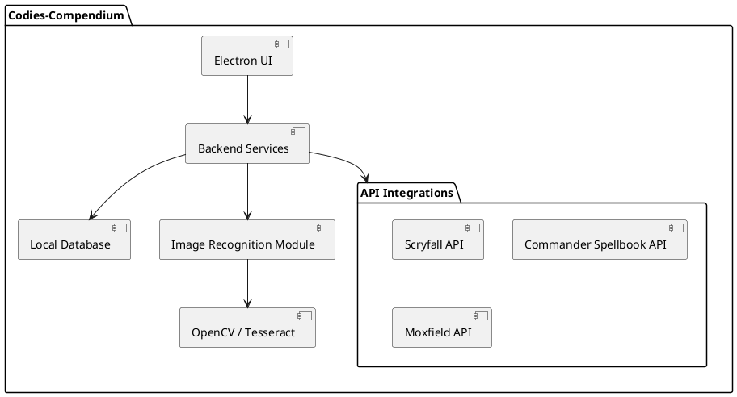
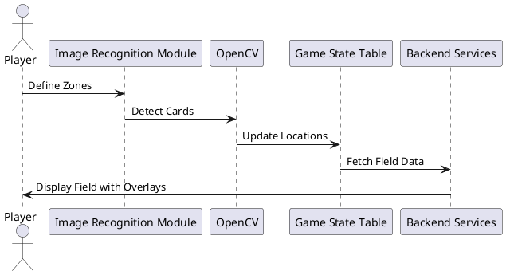

# SPEC-1: Codies-Compendium
## Background

Magic: The Gathering (MTG) Commander format, especially the competitive EDH (cEDH) community, has seen a growing demand for tools that assist in tracking, optimizing, and strategizing gameplay. While various deck-building and online play tools (e.g., Moxfield, Spelltable) offer support, there is no dedicated platform that integrates deck management, probability calculations, and real-time gameplay tracking tailored for MTG enthusiasts. This gap led to the creation of Codies-Compendium.

Codies-Compendium is a local-first desktop application designed to provide in-depth game tracking, deck optimization, and play guidance in real-time. Its robust features aim to support both casual and competitive players with customizable levels of gameplay data. Architected with future cloud expansion in mind, Codies-Compendium will first utilize local storage, transitioning to a cloud-backed solution within 6 months to 2 years. The platform's core goals include cross-platform compatibility with a particular emphasis on Linux support, particularly Arch Linux, to meet the needs of a diverse MTG player base.

## Requirements

The following requirements are organized by priority to ensure that core functionalities are built first, with room for additional features as development progresses.

### Must-Have

* **Local Deck Management**: Users can create, edit, and save decks locally with features for tagging, grouping, and managing deck lists and individual cards.
* **Combo Dashboard**: Track and calculate probabilities for specific combos, including both “true” and “synergistic” combos, across multiple decks.
* **Probability Calculations**: Display probabilities for drawing cards, finding combos, and optimizing moves based on the current board state and hand.
* **Field Tracking and Image Recognition**: Support for physical card tracking via camera integration with field zones (e.g., hand, graveyard) to display real-time gameplay information.
* **Customizable UI**: Tab-based, data-rich HUD with adjustable data visibility for a personalized experience.
* **Cross-Platform Desktop Application**: Desktop application compatible with Windows, macOS, and Linux, with extensive support for Arch Linux.
* **API Integrations**: Integrate with Scryfall for card data and rulings, Commander Spellbook for combos, and Moxfield for live deck editing.

### Should-Have

* **Virtual Hand Simulator**: This is a virtual hand simulator with adjustable “safety” and “speed” settings for testing potential lines.
* **AI Judge for Rules Assistance**: Optional AI-powered recommendations on board state, with rule clarifications for new or ambiguous situations.
* **Token Overlay and Counter Tracking**: Visual overlays on field zones to track tokens, counters, and relevant effects.
* **Shared Screen Mode**: Spectator mode enables shared view access for non-players.

### Could-Have

* **Real-Time Matchmaking Support**: Private, public, and tournament-style matchmaking allows users to find games in various competition levels.
* **Interactive Walkthrough for Onboarding**: A guided tutorial for first-time setup and use of advanced features.

### Won't-Have (for Initial Version)

* **Cloud Data Storage**: Initially, it will be a local-only storage model with plans for cloud integration in future versions.
* **Mobile Support**: The current focus is on desktop, with possible future expansion to mobile if user demand exists.

## Method

The Codies-Compendium platform combines local storage, real-time gameplay tracking, and probability calculations to deliver a robust, cross-platform MTG tool. The following outlines the technical approach to implement these functionalities.

### Architecture Overview

The Codies-Compendium architecture consists of three main layers:
1. **Frontend (Electron-Based UI)**: Delivers a customizable, tab-based HUD and handles user interactions.
2. **Backend Services**: Manages data processing for combo calculations, deck management, and probability analysis.
3. **Image Recognition & Field Tracking Module**: Utilizes OpenCV for object recognition, with potential OCR integration (Tesseract) for card text extraction.

### Local Storage Design

To support local storage with future cloud synchronization, a SQLite database is used, with the following core tables:

**Decks Table**
| Field       | Type       | Description                        |
|-------------|------------|------------------------------------|
| deck_id     | INTEGER PK | Unique identifier for each deck   |
| user_id     | INTEGER    | User ID owning the deck           |
| deck_name   | TEXT       | Name of the deck                  |
| metadata    | JSON       | Additional deck information       |

**Cards Table**
| Field       | Type       | Description                        |
|-------------|------------|------------------------------------|
| card_id     | INTEGER PK | Unique identifier for each card   |
| deck_id     | INTEGER FK | Foreign key to associated deck    |
| card_name   | TEXT       | Name of the card                  |
| card_type   | TEXT       | Type (e.g., creature, spell)      |
| cmc         | INTEGER    | Converted mana cost               |
| tags        | TEXT       | Custom tags for filtering         |

### Probability Calculation Algorithms

Codies-Compendium utilizes a dual-mode probability calculation system to balance deeper statistical analysis with real-time performance.

#### Background Calculation Mode

When a deck is first added or edited, background calculations analyze potential combos, synergy plays, and optimal draw paths. These calculations factor in:
* **Hypergeometric Distribution**: Calculates the probability of drawing specific cards or combo pieces from a larger deck without replacement.
* **Markov Chains**: Evaluates turn-based probabilities for combo pieces to assess likelihood over multiple turns, ideal for decks with high tutor counts.

#### Real-Time Calculation Mode

During gameplay, the system uses lighter, real-time calculations to provide probability estimates for immediate draws, tutoring success, and ramp likelihood. This mode can reference pre-calculated data from the **Combos** table for efficiency and provides on-the-fly probabilities as the game state evolves.

### Image Recognition and Field Tracking Module

The Image Recognition and Field Tracking Module uses OpenCV for object recognition, detecting card placement within designated zones. Tesseract can be optionally integrated for text-based recognition of card names or values, enhancing real-time tracking accuracy.

## Implementation

### Step 1: Environment Setup

1. **Set up Development Environment**: Establish Electron with Node.js for the cross-platform UI. For database, configure SQLite and set up APIs (Scryfall, Moxfield, and Commander Spellbook) with authentication where necessary.
2. **Linux-Specific Configuration**: Implement Arch Linux configuration, including dependencies for OpenCV and Electron, with test runs to validate compatibility and performance.

### Step 2: Core Component Development

1. **Backend Service and Database Setup**:
   - Implement local storage with SQLite, creating tables for **Decks**, **Cards**, **Combos**, and **Game State** as per the schema.
   - Build out API integrations to pull data from Scryfall (for card data), Moxfield (for deck editing), and Commander Spellbook (for combos).
   - Develop background probability calculations for deck entries, using hypergeometric distribution and Markov chains.

2. **Frontend Interface Development**:
   - Construct the Electron-based UI, starting with the tab-based HUD. Add customizable settings for the user-defined “safety” and “speed” sliders.
   - Build the Deck Management interface with options to add tags, groups, and live-edit deck entries.
   - Implement a combo dashboard that fetches data from the **Combos** table, displaying pre-calculated probabilities.

3. **Image Recognition and Field Tracking**:
   - Integrate OpenCV for basic card and token detection, with test calibration for lighting and angle adjustments.
   - Optional: Add Tesseract OCR to recognize card text if required for card-specific tracking.
   - Implement Field Zone Detection and Counter Overlay, integrating with the **Game State** table for dynamic gameplay tracking.

### Step 3: Real-Time Features and Optimization

1. **Real-Time Probability Calculations**: Implement efficient, real-time calculations that draw from the **Combos** table, adjusting based on current game state and slider settings.
2. **AI Judge and Rules Integration**: Add an AI assistant for rules and board recommendations based on game state data, using data from Scryfall to enhance rule clarity.
3. **Testing and Performance Tuning**:
   - Perform extensive tests on each platform, focusing on resource usage, UI responsiveness, and image recognition accuracy.

### Step 4: Pre-Release and Documentation

1. **Final UI and User Experience Enhancements**: Finalize the UI, ensuring easy navigation and customization.
2. **Onboarding Walkthrough and Documentation**: Develop a user tutorial for setup and advanced features, providing guidance on the configuration of field zones and deck management.
3. **Beta Testing and User Feedback**: Conduct closed beta testing, gathering feedback for final adjustments before public release.

## Milestones

The following milestones are set to track development progress and ensure timely delivery of core functionalities and enhancements.

### Milestone 1: Initial Setup and Backend Development
* Complete setup of Electron environment with SQLite database.
* Establish API connections with Scryfall, Commander Spellbook, and Moxfield.
* Implement core database structure and backend services, including local storage for decks, cards, and game state data.

### Milestone 2: Deck Management and Probability Calculations
* Build out Deck Management interface with tagging, grouping, and combo tracking.
* Develop background probability calculations for deck entries.
* Set up the combo dashboard with calculated probabilities.

### Milestone 3: Image Recognition and Field Tracking
* Integrate OpenCV for card detection with initial field zone recognition.
* Complete Field Zone Detection and Counter Overlay.
* Test image recognition under different lighting and angle conditions.

### Milestone 4: Real-Time Features and AI Assistance
* Implement real-time probability calculations and user-defined sliders.
* Integrate AI-based rule assistance for board recommendations.
* Add real-time gameplay tracking with updates to the **Game State** table.

### Milestone 5: Cross-Platform Testing and Linux Optimization
* Conduct platform-specific testing, optimizing for performance on Arch Linux.
* Finalize cross-platform adjustments to ensure compatibility with Windows and macOS.

### Milestone 6: Final UI Polishing and Beta Release
* Complete final UI design and customization options.
* Develop onboarding walkthrough and documentation.
* Launch closed beta to gather user feedback, refine based on testing.

### Milestone 7: Public Release and Post-Launch Review
* Finalize any adjustments from beta feedback.
* Publish public release, monitor for early user feedback.
* Plan for future cloud integration and feature enhancements.

## Gathering Results

The success of Codies-Compendium will be evaluated based on its performance, user satisfaction, and reliability across different platforms. Post-release, the following criteria and feedback mechanisms will be used:

### Performance and Reliability
* **Cross-Platform Functionality**: Confirm smooth operation on Windows, macOS, and Linux, with a particular emphasis on Arch Linux performance.
* **Image Recognition Accuracy**: Evaluate the accuracy and responsiveness of image recognition under various lighting and angle conditions.
* **Probability Calculation Efficiency**: Measure the speed and accuracy of real-time probability calculations, ensuring they align with user-selected “safety” and “speed” preferences.

### User Satisfaction and Usability
* **User Feedback Surveys**: Conduct surveys with a focus on user experience with deck management, field tracking, and gameplay optimization.
* **Feature Use Metrics**: Track usage data for major features (e.g., combo dashboard, virtual hand simulator) to identify popular elements and areas for improvement.
* **Bug and Performance Reports**: Monitor reports for recurring issues or performance bottlenecks, especially on Linux configurations, to prioritize fixes and optimizations.

### Future Development and Cloud Preparation
* **Cloud-Readiness Assessment**: Review the database structure and codebase for ease of migration to cloud storage.
* **Feature Expansion Consideration**: Based on user feedback, evaluate potential features, such as expanded AI-based suggestions and mobile support.

By closely tracking these metrics and feedback channels, Codies-Compendium will continue evolving to serve the MTG Commander community, ensuring a robust and intuitive gameplay experience.
